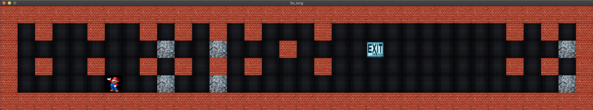

# SoLong



## Summary

The `SoLong` project is a small 2D game designed to improve your skills in working with textures, sprites, and basic gameplay elements using the miniLibX library in C. The game involves navigating a map, collecting items, and reaching the exit while avoiding obstacles.

## Objectives

- Improve skills in graphic design, including windows, colors, events, and textures.
- Utilize basic algorithms and information research.
- Ensure smooth management of the window, including switching windows and minimizing.
- Design a map consisting of walls, collectibles, and free space.
- Collect all collectibles on the map and escape with minimal movement.
- Display the current number of movements in the shell after each move.
- Implement player movement: up, down, left, right.
- Use a 2D view (top-down or profile).
- The game does not need to be real-time.
- Player cannot move into walls.
- Implement keyboard and window event handling using the miniLibX library.

## Installation

Before using this project, ensure that miniLibX is installed on your computer. You can find installation instructions [here](https://harm-smits.github.io/42docs/libs/minilibx/getting_started.html).

## Usage

To compile the project, use the provided Makefile:

```bash
make
```

This will compile your project and create the `SoLong` executable.

To run the game, provide a map description file with the `.ber` extension as the first argument:

```bash
./SoLong map.ber
```

## Map Description File

- The map must be described in a file with the `.ber` extension.
- The map is composed of the following characters:
  - `0`: Empty space
  - `1`: Wall
  - `C`: Collectible
  - `E`: Map exit
  - `P`: Player's starting position
- The map must be surrounded by walls.
- The map must contain at least one exit, one collectible, and one starting position.
- The map must be rectangular.
- The program will exit with an error if any misconfiguration is encountered in the file.

## Examples

Below is an example of a simple valid map:

```
1111111111111
10010000000C1
1000011111001
1P0011E000001
1111111111111
```

## Error Handling

If any misconfiguration is encountered in the map file, the program will exit properly and return "Error\n" followed by an explicit error message.

## Authors

Anouar Elissaoui

## Acknowledgments

This project was completed as part of the curriculum at 1337-School(42-Network).

## License

This project is licensed under the MIT License.
